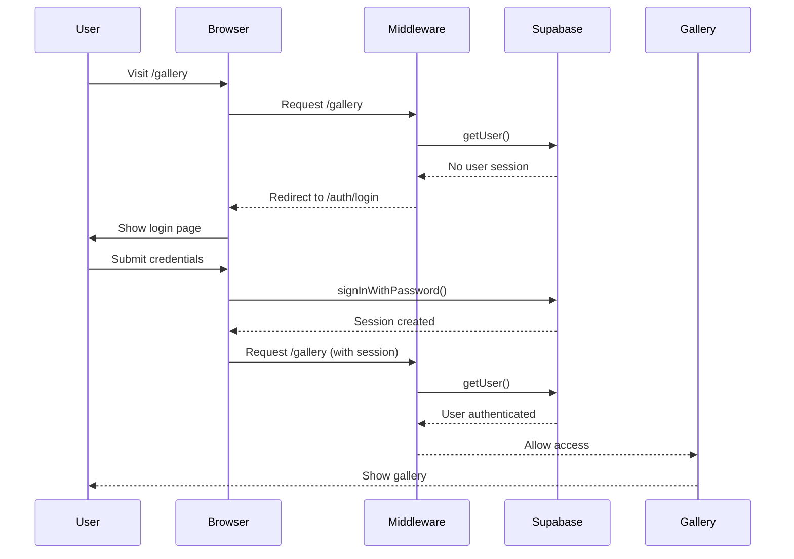

Galey Cloud uses Supabase Authentication to secure user accounts and ensure each user can only access their own photos and albums. The authentication system includes sign up, login, session management, and route protection.

## Authentication Setup

### Supabase Client Configuration

Galey Cloud uses two Supabase clients: one for client-side operations and one for server-side:

#### Client-Side

```typescript
import { createBrowserClient } from '@supabase/ssr'

export function createClient() {
  return createBrowserClient(
    process.env.NEXT_PUBLIC_SUPABASE_URL!,
    process.env.NEXT_PUBLIC_SUPABASE_ANON_KEY!,
  )
}
```

Location: `lib/supabase/client.ts:3-8`

#### Server-Side

```typescript
import { createServerClient } from '@supabase/ssr'
import { cookies } from 'next/headers'

export async function createClient() {
  const cookieStore = await cookies()

  return createServerClient(
    process.env.NEXT_PUBLIC_SUPABASE_URL!,
    process.env.NEXT_PUBLIC_SUPABASE_ANON_KEY!,
    {
      cookies: {
        getAll() {
          return cookieStore.getAll()
        },
        setAll(cookiesToSet) {
          try {
            cookiesToSet.forEach(({ name, value, options }) =>
              cookieStore.set(name, value, options),
            )
          } catch {
            // The "setAll" method was called from a Server Component.
            // This can be ignored if you have middleware refreshing
            // user sessions.
          }
        },
      },
    },
  )
}
```

Location: `lib/supabase/server.ts:9-34`

<Info>
  The server-side client properly handles Next.js cookies for secure session management. Always create a new client instance for each request (important for Vercel Fluid compute).
</Info>

## Sign Up Flow

The sign-up page allows new users to create an account:

```tsx
'use client'

import { createClient } from '@/lib/supabase/client'
import { useState } from 'react'
import { useRouter } from 'next/navigation'

export default function Page() {
  const [email, setEmail] = useState('')
  const [password, setPassword] = useState('')
  const [repeatPassword, setRepeatPassword] = useState('')
  const [error, setError] = useState<string | null>(null)
  const [isLoading, setIsLoading] = useState(false)
  const router = useRouter()

  const handleSignUp = async (e: React.FormEvent) => {
    e.preventDefault()
    const supabase = createClient()
    setIsLoading(true)
    setError(null)

    if (password !== repeatPassword) {
      setError('Las contrasenas no coinciden')
      setIsLoading(false)
      return
    }

    try {
      const { error } = await supabase.auth.signUp({
        email,
        password,
        options: {
          emailRedirectTo:
            process.env.NEXT_PUBLIC_DEV_SUPABASE_REDIRECT_URL ||
            `${window.location.origin}/gallery`,
        },
      })
      if (error) throw error
      router.push('/auth/sign-up-success')
    } catch (error: unknown) {
      setError(error instanceof Error ? error.message : 'Ocurrio un error')
    } finally {
      setIsLoading(false)
    }
  }

  return (
    <form onSubmit={handleSignUp}>
      {/* Form fields */}
    </form>
  )
}
```

Location: `app/auth/sign-up/page.tsx:18-55`

<Steps>
  <Step title="User enters email and password">
    Password must be entered twice for confirmation
  </Step>
  <Step title="Passwords are validated">
    Client-side check ensures passwords match
  </Step>
  <Step title="Supabase creates account">
    User record is created with email verification link sent
  </Step>
  <Step title="Redirect to success page">
    User is shown confirmation message to check email
  </Step>
</Steps>

## Login Flow

The login page authenticates existing users:

```tsx
'use client'

import { createClient } from '@/lib/supabase/client'
import { useState } from 'react'
import { useRouter } from 'next/navigation'

export default function Page() {
  const [email, setEmail] = useState('')
  const [password, setPassword] = useState('')
  const [error, setError] = useState<string | null>(null)
  const [isLoading, setIsLoading] = useState(false)
  const router = useRouter()

  const handleLogin = async (e: React.FormEvent) => {
    e.preventDefault()
    const supabase = createClient()
    setIsLoading(true)
    setError(null)

    try {
      const { error } = await supabase.auth.signInWithPassword({
        email,
        password,
      })
      if (error) throw error
      router.push('/gallery')
    } catch (error: unknown) {
      setError(error instanceof Error ? error.message : 'Ocurrio un error')
    } finally {
      setIsLoading(false)
    }
  }

  return (
    <form onSubmit={handleLogin}>
      {/* Form fields */}
    </form>
  )
}
```

Location: `app/auth/login/page.tsx:18-43`

<Steps>
  <Step title="User enters credentials">
    Email and password are submitted via form
  </Step>
  <Step title="Supabase validates credentials">
    `signInWithPassword` checks against stored user data
  </Step>
  <Step title="Session created">
    Authentication cookies are set automatically
  </Step>
  <Step title="Redirect to gallery">
    User is redirected to `/gallery` on successful login
  </Step>
</Steps>

## Session Management

### Middleware Session Refresh

The middleware automatically refreshes user sessions on each request:

```typescript
import { createServerClient } from '@supabase/ssr'
import { NextResponse, type NextRequest } from 'next/server'

export async function updateSession(request: NextRequest) {
  let supabaseResponse = NextResponse.next({
    request,
  })

  const supabase = createServerClient(
    process.env.NEXT_PUBLIC_SUPABASE_URL!,
    process.env.NEXT_PUBLIC_SUPABASE_ANON_KEY!,
    {
      cookies: {
        getAll() {
          return request.cookies.getAll()
        },
        setAll(cookiesToSet) {
          cookiesToSet.forEach(({ name, value }) =>
            request.cookies.set(name, value),
          )
          supabaseResponse = NextResponse.next({
            request,
          })
          cookiesToSet.forEach(({ name, value, options }) =>
            supabaseResponse.cookies.set(name, value, options),
          )
        },
      },
    },
  )

  // IMPORTANT: getUser() must be called to refresh the session
  const {
    data: { user },
  } = await supabase.auth.getUser()

  if (
    request.nextUrl.pathname.startsWith('/gallery') &&
    !user
  ) {
    const url = request.nextUrl.clone()
    url.pathname = '/auth/login'
    return NextResponse.redirect(url)
  }

  return supabaseResponse
}
```

Location: `lib/supabase/middleware.ts:4-69`

<Warning>
  **Critical:** Always call `supabase.auth.getUser()` in middleware. Skipping this can cause users to be randomly logged out due to stale sessions.
</Warning>

### Middleware Configuration

```typescript
import { updateSession } from '@/lib/supabase/middleware'
import { type NextRequest } from 'next/server'

export async function middleware(request: NextRequest) {
  return await updateSession(request)
}

export const config = {
  matcher: [
    '/((?!_next/static|_next/image|favicon.ico|.*\\.(?:svg|png|jpg|jpeg|gif|webp)$).*)',
  ],
}
```

Location: `middleware.ts:4-20`

The matcher ensures middleware runs on all routes except static assets and images.

## Protected Routes

### Route Protection

The `/gallery` route is protected by the middleware:

```typescript
if (
  request.nextUrl.pathname.startsWith('/gallery') &&
  !user
) {
  const url = request.nextUrl.clone()
  url.pathname = '/auth/login'
  return NextResponse.redirect(url)
}
```

Location: `lib/supabase/middleware.ts:44-52`

Unauthenticated users attempting to access `/gallery` are automatically redirected to the login page.

### API Route Protection

All API routes validate authentication:

```typescript
export async function GET() {
  const supabase = await createClient()
  const { data: { user } } = await supabase.auth.getUser()
  if (!user) {
    return NextResponse.json({ error: 'No autorizado' }, { status: 401 })
  }

  // Continue with authenticated logic...
}
```

Example from: `app/api/photos/route.ts:4-10`

## Row-Level Security (RLS)

Supabase's row-level security ensures users can only access their own data. All database queries include user verification:

```typescript
// Only fetch photos belonging to the authenticated user
const { data, error } = await supabase
  .from('photos')
  .select('*')
  .eq('user_id', user.id)
  .order('created_at', { ascending: false })
```

Example from: `app/api/photos/route.ts:12-16`

<CardGroup cols={2}>
  <Card title="Photos API" icon="image">
    `.eq('user_id', user.id)` filters photos
  </Card>
  <Card title="Albums API" icon="folder">
    `.eq('user_id', user.id)` filters albums
  </Card>
</CardGroup>

## Logout

Users can sign out from the gallery sidebar:

```tsx
const handleLogout = useCallback(async () => {
  const supabase = createClient()
  await supabase.auth.signOut()
  router.push('/auth/login')
}, [router])
```

Location: `app/gallery/page.tsx:163-167`

<Steps>
  <Step title="User clicks logout button">
    Located in the AlbumSidebar component
  </Step>
  <Step title="Supabase session cleared">
    `signOut()` removes authentication cookies
  </Step>
  <Step title="Redirect to login">
    User is sent back to the login page
  </Step>
</Steps>

## Environment Variables

Authentication requires these environment variables:

```bash
NEXT_PUBLIC_SUPABASE_URL=https://your-project.supabase.co
NEXT_PUBLIC_SUPABASE_ANON_KEY=your-anon-key
```

<Note>
  The `NEXT_PUBLIC_` prefix makes these variables accessible in both client and server code. The anon key is safe to expose publicly as Supabase uses RLS to protect data.
</Note>

## Authentication Flow Diagram



## Security Best Practices

<AccordionGroup>
  <Accordion title="Always use server-side client for API routes">
    API routes should use `createClient()` from `lib/supabase/server.ts` to ensure proper cookie handling and session validation.
  </Accordion>
  
  <Accordion title="Validate user on every API call">
    Never trust client-side authentication. Always call `supabase.auth.getUser()` and check for a valid user before processing requests.
  </Accordion>
  
  <Accordion title="Use RLS in database queries">
    Always filter by `user_id` to ensure users can only access their own data, even if RLS policies are configured in Supabase.
  </Accordion>
  
  <Accordion title="Don't skip getUser() in middleware">
    Calling `getUser()` is critical for session refresh. Omitting it can cause random logout issues.
  </Accordion>
</AccordionGroup>

## Related Pages

<CardGroup cols={2}>
  <Card title="Gallery" icon="grid" href="/features/gallery">
    Protected gallery interface
  </Card>
  <Card title="Photos API" icon="image" href="/features/photos">
    API routes with authentication
  </Card>
</CardGroup>